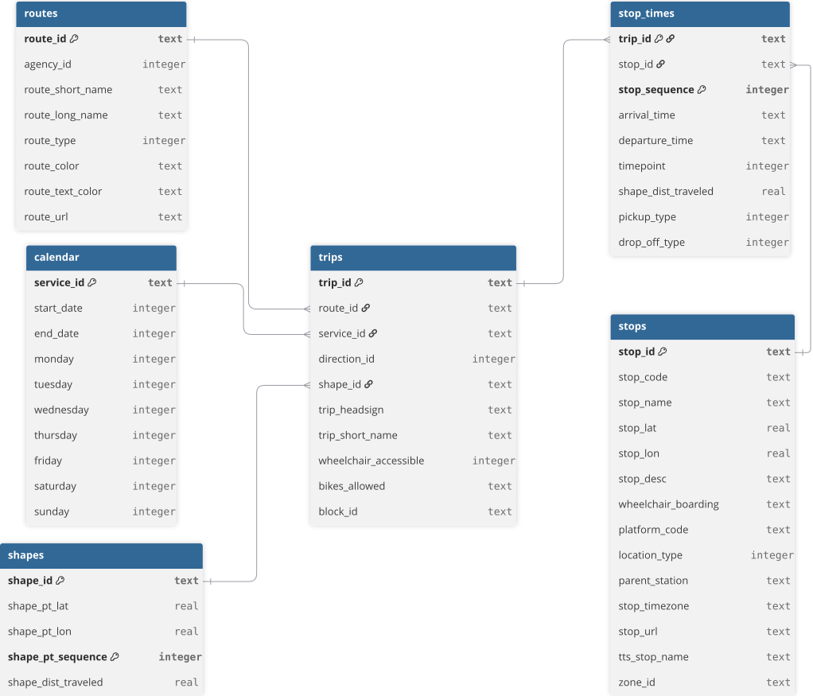
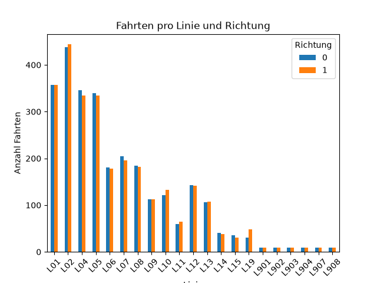
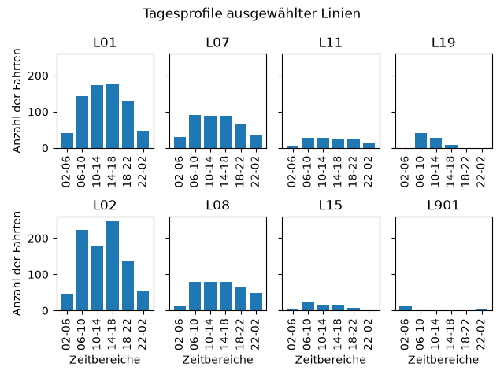
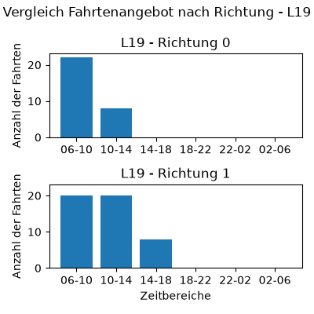
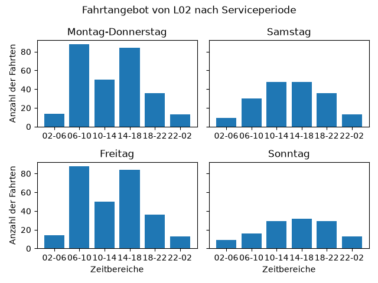

# Analyse des Fahrtenangebots im Ulmer ÖPNV

## Fragestellung
Im Rahmen dieses Projekts wurde untersucht, wie sich das Fahrtenangebot im Ulmer ÖPNV nach Linie, Fahrtrichtung und Tageszeit unterscheidet.
Dazu wurde ein Datensatz der Stadtwerke Ulm/Neu-Ulm (SWU) analysiert.
Schwerpunkt der Analyse war die Anzahl der Fahrten je Linie und Richtung sowie deren Verteilung über verschiedene Tageszeiten.
Aus auffälligen Mustern wurde anschließend eine konkrete Hypothese zur Linie L02 abgeleitet und anhand der Serviceperioden näher betrachtet.

## Datensatz
Für die Analyse wurde der öffentlich bereitgestellte GTFS-Datensatz der SWU Verkehr GmbH verwendet. GTFS (General Transit Feed Specification) ist ein standardisiertes Format zur Abbildung von Fahrplandaten.

Quelle: SWU Verkehr GmbH – API-/GTFS-Daten
Format: GTFS
Lizenz: CC0
Abruf: https://www.swu.de/privatkunden/service/nahverkehr/gtfs-daten

Datensatz abgerufen am: 18.09.2026

## Datenstruktur
Der verwendete SWU-GTFS-Datensatz besteht aus mehreren miteinander verknüpften Tabellen. Für die Analyse sind insbesondere routes, trips, stop_times, stops, calendar und shapes relevant.

Die folgende Übersicht zeigt die für das Projekt relevanten Tabellen, Primary Keys und Beziehungen zwischen den Tabellen:

Für die Analyse wird insbesondere die Beziehung routes → trips → stop_times genutzt. routes beschreibt die Linien, trips einzelne Fahrten und stop_times die Haltestellenfolgen der jeweiligen Fahrt. calendar liefert Informationen zu den Serviceperioden. shapes beschreibt die räumlichen Streckenverläufe.

## Methodik

Die Analyse wurde in zwei Schritten durchgeführt: Die Daten wurden zunächst mit SQL abgefragt und aggregiert. Anschließend wurden die Daten mit Python, Pandas und Matplotlib aufbereitet und visualisiert.

Vor der Analyse wurde die referenzielle Konsistenz der zentralen Tabellen geprüft. Dabei wurden keine fehlenden Verknüpfungen zwischen routes, trips und stop_times festgestellt.

Die zentrale Anaylse erfolgt auf Ebene von Linie 'route_id' und Fahrtrichtung 'direction_id'. 
Eine Fahrt wurde anhand ihrer ersten Abfahrtsstunde genau einem von sechs Zeitbereichen zugeordnet: 06-10, 10-14, 14-18, 18-22, 22-02 und 02-06 Uhr. Dabei wurden auch die im GTFS-Datensatz verwendeten Zeitangaben über 24:00 Uhr berücksichtigt.
Unterschiedliche Fahrtziele 'trip_headsign' und Streckenvarianten 'shape_id' innerhalb einer Linienrichtung wurden für die Hauptanalyse nicht getrennt ausgewertet.

Aus den Ergebnissen der deskriptiven Analyse wurde anschließend ein auffälliges Muster bei der Linie L02 identifiziert. Dieses wurde als Hypothese formuliert und anhand der Serviceperioden 'service_id' gezielt überprüft.

## Ergebnisse

1. Das Fahrtenangebot unterscheidet sich deutlich zwischen den Linien.
   
L01, L02, L04 und L05 weisen vergleichsweise hohe Fahrtenzahlen auf.
L14, L15 und L19 haben deutlich eingeschränktere Fahrtenangebote.
L901 bis L908 bieten die wenigsten Fahrten an.

Die Abbildung zeigt die Anzahl der Fahrten je Linie und Fahrtrichtung. Dabei wird sichtbar, dass sich das Fahrtenangebot zwischen den Linien deutlich unterscheidet. Bei mehreren Linien liegen die Fahrtenzahlen der beiden Richtungen nah beieinander, während bei einzelnen Linien größere Unterschiede auftreten.

2. Das Fahrtenangebot verändert sich im Tagesverlauf.
   
Aus der Betrachtung der Tagesprofile lassen sich wiederkehrende Angebotsmuster erkennen.
    1. relativ dichtes Tagesangebot, tageszeitlich stärker schwankend: z. B. L01, L02, L04, L05
    2. relativ konstantes Tagesangebot, anschließend Rückgang am Abend: z. B. L06, L07, L08, L09, L13
    3. kleineres bzw. stärker eingeschränktes Angebot: z. B. L11, L14, L15
    4. Nachtangebot: L901–L908

Bei L02 fällt insbesondere das erhöhte Fahrtenangebot in den Zeitbereichen 06-10 Uhr und 14-18 Uhr auf.
Bei L10 und L19 zeigt sich in den Daten ein deutlicher Angebotsunterschied zwischen den Fahrtrichtungen.

In der Abbildung sind exemplarisch ausgewählte Tagesprofile gezeigt. Es ist erkennbar, dass sich das Fahrtenangebot der Linien unterschiedlich über den Tagesverlauf verteilt. 

3. Auch innerhalb der Linien gibt es Unterschiede zwischen den Fahrtrichtungen.
   
Die meisten Linien zeigen ein ähnliches Muster im Fahrtenangebot zwischen den Fahrtrichtungen. 
Bei einzelnen Linien treten jedoch deutliche Unterschiede auf. Besonders auffällig ist L19, bei der sich das 
Fahrtenangebot der beiden direction_id im Tagesverlauf deutlich unterscheidet.

Die folgende Abbildung zeigt das Fahrtangebot der Linie L09 im Tagesverlauf, aufgetrennt nach Fahrtrichtungen.

4. Bei L02 zeigt sich ein auffälliges Muster in bestimmten Tageszeiten.
   
Wie in der Abbildung zu sehen ist, weist L02 insbesondere in den Zeitbereichen 06-10 und 14-18 Uhr ein vergleichsweise hohes Fahrtenangebot auf. Dies zeigt sich vor allem  in den werktäglichen Serviceperioden.
Die Auswertung stützt damit die Hypothese, dass das höhere Angebot in diesen Zeitbereichen insbesondere mit dem werktäglichen Betrieb zusammenhängt.
Eine mögliche Interpretation ist, dass dieses Muster in den Zeiträumen mit einem höheren Bedarf zu Schul- und Arbeitszeiten zusammenhängen könnte. Aus den Fahrplandaten allein lässt sich jedoch nicht feststellen, welche Nutzergruppen tatsächlich für dieses Muster verantwortlich sind.

## Projektstruktur

* sql/ – SQL-Abfragen
* python/ – Python-Analyse und Visualisierungen
* schema/ – Datenbankschema
* images/ – Visualisierungen und Schema-Grafik

Verwendete Technologien: SQLite, SQL, Python, Pandas, Matplotlib, dbdiagram.io

